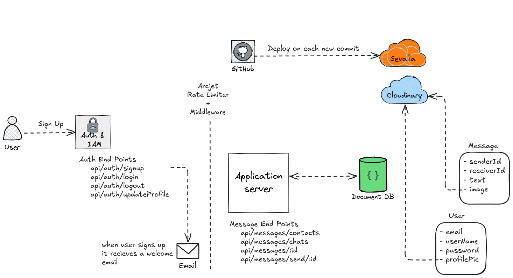

# brotocalll

**brotocall** is a full-stack real-time chat application built with modern web technologies.  
It supports **authentication**, **real-time messaging**, **media uploads**, and **automated deployment** — designed with scalability and simplicity in mind.

---

## Table of Contents

- [Overview](#-overview)
- [Features](#-features)
- [Tech Stack](#-tech-stack)
- [Architecture](#-architecture)
- [API Endpoints](#-api-endpoints)
- [Setup and Installation](#-setup-and-installation)
- [Environment Variables](#-environment-variables)
- [Deployment](#-deployment)
- [Future Improvements](#-future-improvements)
- [License](#-license)

---

## Overview

brotocall allows users to:

- Sign up, log in, and update their profiles.  
- Send and receive messages in real time.  
- Upload and share images using **Cloudinary**.  
- Store user and message data in a **NoSQL (Document)** database.  
- Automatically deploy to **Sevalla** via **GitHub CI/CD** on every new commit.  

It’s equipped with **Arcjet rate limiting and middleware** to ensure performance and security.

---

## Features

- User authentication (Sign up, Login, Logout, Profile update)  
- Real-time messaging between users  
- Cloud image upload via Cloudinary  
- MongoDB (Document DB) for storing users and messages  
- Automatic deployment on each GitHub commit  
- Welcome email on signup  
- Arcjet rate limiting for abuse prevention  

---

## Tech Stack

**Frontend:**  
- React.js

**Backend:**  
- Node.js  
- Express.js  
- MongoDB (Mongoose)  
- Cloudinary (for media storage)  
- Arcjet (rate limiting)

**DevOps & Deployment:**  
- GitHub (CI/CD integration)  
- Sevalla (hosting)

---

## Architecture

Here’s the high-level architecture of brotocall:


### Key Components

#### Auth & IAM
Handles user registration, login, logout, and profile management.  
Sends a welcome email upon signup.

#### Application Server
Core backend handling API logic, middleware, and communication between services.

#### Document DB
Stores **User** and **Message** collections.

**User Schema**
```json
{
  "email": "string",
  "userName": "string",
  "password": "string",
  "profilePic": "string"
}
```

**Message Schema**
```json
{
  "senderId": "ObjectId",
  "receiverId": "ObjectId",
  "text": "string",
  "image": "string"
}
```

#### Cloudinary
Stores user profile pictures and chat media.

#### Arcjet Middleware
Adds security and rate limiting to prevent abuse.

#### GitHub + Sevalla
Automatic deployment pipeline — new commits trigger updates to the live environment.

---

## API Endpoints

### **Auth Routes**

| Method | Endpoint | Description |
|--------|-----------|-------------|
| POST | `/api/auth/signup` | Register a new user |
| POST | `/api/auth/login` | Log in an existing user |
| POST | `/api/auth/logout` | Log out user |
| PUT | `/api/auth/updateProfile` | Update user info (e.g., profile pic) |

---

### **Message Routes**

| Method | Endpoint | Description |
|--------|-----------|-------------|
| GET | `/api/messages/contacts` | Get user’s contacts |
| GET | `/api/messages/chats` | Fetch user’s chat list |
| GET | `/api/messages/:id` | Get all messages with a specific user |
| POST | `/api/messages/send/:id` | Send a new message |

---

## Setup and Installation

1. **Clone the repository**
   ```bash
   git clone https://github.com/iamAmer/brotocalll.git
   cd brotocalll
   ```

2. **Install dependencies**
   ```bash
   npm install
   ```

3. **Configure environment variables** (see below)

4. **Run the server**
   ```bash
   npm run dev
   ```

---

## Environment Variables

Create a `.env` file in the root directory and include:

```env
PORT=3000
MONGO_URI=your_mongo_uri_here

NODE_ENV=development

JWT_SECRET=your_jwt_secret

RESEND_API_KEY=your_resend_api_key
EMAIL_FROM=your_email_from_address
EMAIL_FROM_NAME=your_email_from_name

CLIENT_URL=http://localhost:5173

CLOUDINARY_CLOUD_NAME=your_cloudinary_cloud_name
CLOUDINARY_API_KEY=your_cloudinary_api_key
CLOUDINARY_API_SECRET=your_cloudinary_api_secret

ARCJET_KEY=your_arcjet_key
ARCJET_ENV=development
```

---

## Deployment

brotocall is automatically deployed to **Sevalla** through **GitHub Actions** on each commit.  

- Live Demo: [brotocall](https://brotocall-kq897.sevalla.app/)   
- You can manually trigger deployment by pushing to the main branch:

```bash
git add .
git commit -m "deploy: update feature"
git push origin main
```
---

## License

This project is licensed under the **MIT License** — free for personal and commercial use.

---

### Author

Developed by [**@iamAmer**](https://github.com/iamAmer)
